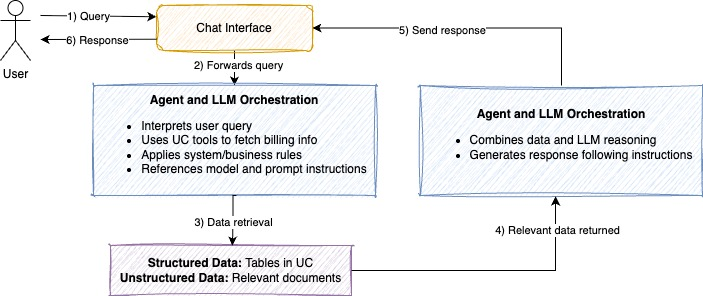
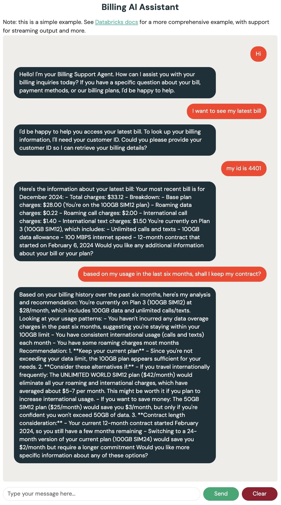

## Business Problem

Telecoms are leveraging AI to achieve first-point resolution on customer issues and unify fragmented customer data to proactively enhance customer engagement and retention. This solution leverages AI to analyze incoming customer communications, understanding context and sentiment to prepare tailored responses for agents. We have picked one of the common billing issues for telco customers. 

This industry solution accelerator enables the automation and personalization of telecom billing customer care by leveraging customer-specific data available within the data ecosystem.

The aim is to help telco providers scale customer service operations with an AI-powered billing agent that leverages:
- Billing history, customer profiles, and device data
- Unstructured FAQs embedded in a vector search index
- Human-in-the-loop evaluation and observability tools
- A deployable web interface for interactive usage

Designed as a human-in-the-loop solution, it empowers customer service agents to resolve billing queries faster and more accurately, improving CX and reducing call centre load.

<p align="center">
  
</p>


---


## Authors
Kyra Wulffert <kyra.wulffert@databricks.com><br>
Sachin Patil <sachin.patil@databricks.com>

---

## Repository Structure

| Notebook | Description |
|----------|-------------|
| `000-config` | Central config for the accelerator  |
| `00_data_preparation` | Synthetic data generation using [Databricks Labs Data Generator](https://github.com/databrickslabs/dbldatagen). Simulates billing, device, and customer datasets. |
| `01_create_vector_search` | Builds the FAQ dataset and creates a vector search index using Databricks Vector Search. |
| `02_define_uc_tools` | Defines functions as tools in Unity Catalog. These are callable by the agent to query customer, billing, and device information and retrieve relevant data from the vector search with FAQ. |
| `03a_create_genie_space` | Creates a Databricks Genie Space for ad-hoc billing analytics over invoice and plan tables. |
| `03_agent_deployment_and_evaluation` | Builds, logs, evaluates, registers, and deploys the LangGraph agent to a model serving endpoint. |
| `04_agent_bricks_deployment` | Deploys the solution as a Databricks Agent Bricks Supervisor Agent combining a FAQ Knowledge Assistant with the Billing Analytics Genie Space. |
| `05_billing_anomaly_detection` | PySpark pipeline that detects billing anomalies (charge spikes, roaming spikes, data overages) and writes results to a Delta table with a UC function tool. |
| `06b_enable_streaming_prereqs` | One-time setup: enables CDF on billing_items, creates billing_monitoring_state table and billing_monitoring_summary view. |
| `06_dlt_streaming_pipeline` | DLT pipeline definition. Produces billing_events_streaming (enriched events) and billing_monthly_running (real-time charge accumulators). Not directly runnable — deployed by 06a. |
| `06a_create_dlt_pipeline` | Creates and starts the DLT continuous streaming pipeline via Databricks SDK. |
| `06c_monitoring_alerter` | Alert dispatch: finds unalerted anomalies and writes to billing_monitoring_state. Runs as Task 2 in the daily workflow. |
| `07_system_table_ingestion` | Materializes Databricks system tables (billing.usage, lakeflow.job_run_timeline, query.history) into Bronze/Silver/Gold telemetry tables. Requires system catalog access. |
| `08_federation_setup` | Sets up Lakehouse Federation: UC connection to external ERP (Track A). Skip for Track B (simulation). |
| `08a_erp_data_simulation` | Generates synthetic ERP accounts/orders, procurement costs, and FX rates (Track B). Creates ext_* view abstraction layer. |
| `08b_external_data_ingestion` | Medallion pipeline: ext_* views -> Silver (customer_account_dims, fx_daily, procurement_monthly) -> Gold (revenue_attribution, finance_operations_summary). |
| `09_writeback_setup` | Creates billing_disputes and billing_write_audit tables. Adds acknowledgement columns to billing_anomalies. Run before agent re-deployment. |
| `09a_dispute_aging` | Nightly dispute SLA enforcement: auto-escalates disputes open > 5 days. Runs as Task 5 in daily workflow. |
| `10_domain_config` | Domain adapter: reads domain YAML from `notebooks/domains/`, creates canonical views, regenerates UC tools. Run with `domain` = `telco` / `saas` / `utility`. |
| `10a_validate_domain` | Validates deployed domain: checks canonical views, UC tools, charge column alignment. |
| `11_persona_config` | Validates all persona YAML configs from `notebooks/personas/`, serializes persona metadata to config.yaml. |
| `12_deploy_dash_chatbot_app` | Creates or updates the **Databricks App** for the Dash UI, binds the model serving endpoint, deploys `apps/dash-chatbot-app` from the workspace, and starts compute. |
| `13_deploy_gradio_chatbot_app` | Same as **12** for the **Gradio** UI (`apps/gradio-chatbot-app`); default app name `billing-gradio-chat`. |
| `dash-chatbot-app/` | Dash web app source; `app.yaml` + `app.py` run on Databricks Apps. |
| `gradio-chatbot-app/` | Gradio web app source; same serving endpoint + `model_serving_utils` contract as Dash. |
| `scripts/workspace_app_deploy.py` | Shared SDK helpers (`deploy_serving_endpoint_app`) used by the deploy scripts below. |
| `scripts/deploy_dash_chatbot_app.py` | Same deployment flow as notebook **12** from a local machine (requires `--source-code-path` under `/Workspace/...`). |
| `scripts/deploy_gradio_chatbot_app.py` | Same as **13** from a local machine for `apps/gradio-chatbot-app`. |

---

## How to Use

Follow the notebooks in **numerical order** for a smooth end-to-end experience:

1. **[000-config]** – Set up your catalog, schema, endpoint names, and runtime parameters.
2. **[00_data_preparation]** – Generate synthetic datasets for billing, customers, and devices.
3. **[01_create_vector_search]** – Build the FAQ dataset, create a Delta table, and generate a vector search index.
4. **[02_define_uc_tools]** – Define tools that expose customer data to the agent.
5. **[03a_create_genie_space]** – Create a Genie Space for ad-hoc billing analytics.
6. **[03_agent_deployment_and_evaluation]** – Build and log the LangGraph agent to MLflow, run agent evaluation, register to Unity Catalog, and deploy to a serving endpoint.
7. **[04_agent_bricks_deployment]** – Deploy as an Agent Bricks Supervisor Agent (KA + Genie Space) for a fully managed multi-agent experience.
8. **[05_billing_anomaly_detection]** – Run anomaly detection pipeline, create UC function tool and Genie table, then redeploy agent.
9. **[`dash-chatbot-app`]** – Run the chatbot locally (set `SERVING_ENDPOINT`) or deploy to Databricks Apps.
10. **[12_deploy_dash_chatbot_app]** – Deploy the Dash app to **Databricks Apps** (SDK: create app, bind serving endpoint, deploy source, start compute). Requires the repo layout `apps/dash-chatbot-app` next to `notebooks/` in the workspace (e.g. Repos clone).
11. **[13_deploy_gradio_chatbot_app]** – Deploy the **Gradio** alternative UI (`apps/gradio-chatbot-app`); workspace app name defaults to **`billing-gradio-chat`** so it can run alongside the Dash app.

### Deploy the Dash app (Databricks Asset Bundles)

After the agent serving endpoint exists (notebook **03**), the bundle at the project root (`databricks.yml`) defines the **billing-chatbot** (Dash) and **billing-gradio-chat** (Gradio) apps and grants **CAN QUERY** on the model serving endpoint named by `serving_endpoint_name` (default `ai_customer_billing_agent`, matching `000-config`). Each app’s `app.yaml` maps that resource to `SERVING_ENDPOINT`.

```bash
databricks bundle validate
databricks bundle deploy --var serving_endpoint_name=<your-endpoint-name>
databricks bundle run billing_chatbot_app
databricks bundle run gradio_chatbot_app
```

If the app does not start on compute automatically, use **Compute → Apps** in the workspace or `databricks apps deploy <app-name> --profile <profile>`. In GitHub Actions, set repository variable **SERVING_ENDPOINT_NAME** when the endpoint name differs from the default.

From the command line (same behavior as notebooks **12** / **13**), after authenticating the CLI:

```bash
python scripts/deploy_dash_chatbot_app.py \
  --source-code-path /Workspace/Users/you@example.com/Repos/org/repo/apps/dash-chatbot-app \
  --serving-endpoint ai_customer_billing_agent

python scripts/deploy_gradio_chatbot_app.py \
  --source-code-path /Workspace/Users/you@example.com/Repos/org/repo/apps/gradio-chatbot-app \
  --serving-endpoint ai_customer_billing_agent
```

---

## Highlights

- **End-to-end LLM agent lifecycle**: From data to deployment.
- **Evaluation-first approach**: Includes synthetic question generation and MLflow integration for benchmarking agent performance.
- **Built-in vector search**: FAQ retrieval using vector search index and semantic similarity.
- **Fully governed**: Unity Catalog integration for tool and model registration.
- **Deployable UI**: Dash and Gradio apps included for real-world usage and demoing on Databricks Apps.

<p align="center">
  
</p>

---

## Requirements

- Databricks workspace with Unity Catalog enabled
- Access to Databricks Vector Search & Serving Endpoints
- Installed: `databricks-sdk`, `databricks-vectorsearch`, `mlflow`, `dash`, `gradio`, `langchain`, etc.
- Cluster or SQL Warehouse to execute notebooks
- Recommended Databricks Runtime: 15.4 ML

---

## Get Started

Start with `000-config` and move through each notebook step-by-step.  
This project is designed to be modular—feel free to extend tools, customize prompts, or connect new data sources.

---

## Project support 

Please note the code in this project is provided for your exploration only, and are not formally supported by Databricks with Service Level Agreements (SLAs). They are provided AS-IS and we do not make any guarantees of any kind. Please do not submit a support ticket relating to any issues arising from the use of these projects. The source in this project is provided subject to the Databricks [License](./LICENSE.md). All included or referenced third party libraries are subject to the licenses set forth below.

Any issues discovered through the use of this project should be filed as GitHub Issues on the Repo. They will be reviewed as time permits, but there are no formal SLAs for support. 

---

## License

&copy; 2025 Databricks, Inc. All rights reserved. The source in this notebook is provided subject to the Databricks License [https://databricks.com/db-license-source].  All included or referenced third party libraries are subject to the licenses set forth below. 

##This list needs to be updated

| library                                | description             | license    | source                                              |
|----------------------------------------|-------------------------|------------|-----------------------------------------------------|
|  | |  |


